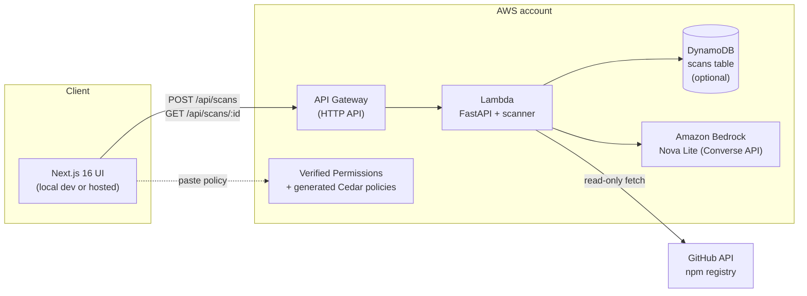

# Architecture

MCP Guardian is a two-tier app: a **FastAPI backend** that fetches, statically analyzes, and scores MCP server source code, and a **Next.js 16 frontend** that submits scans and renders the report. Everything it produces — findings, tool inventory, risk score, Cedar policy, Bedrock narrative — lives in a single `ScanResult` JSON document that both tiers share as a contract.

## Component map

| Component | Location | Responsibility |
| --- | --- | --- |
| API | `backend/app/main.py` | Routes (`POST /api/scans`, `GET /api/scans`, `GET /api/scans/{id}`, `GET /api/health`), CORS, background scan worker |
| Data contract | `backend/app/models.py` ↔ `frontend/src/lib/types.ts` | Pydantic models (camelCase JSON aliases) mirrored by TypeScript interfaces |
| Store | `backend/app/store.py` | `Store` Protocol + `SQLiteStore` implementation; DynamoDB store is a drop-in for the Lambda deploy |
| Fetcher | `backend/app/scanner/fetch.py` | Paste / GitHub / npm → `SourceBundle` (path → text content map). Bounded reads: 40 files, 200 KB/file, text extensions only |
| Analyzer | `backend/app/scanner/analyze.py` | Tool extraction + 17-rule static registry → findings, risk score, level |
| Cedar generator | `backend/app/policy/cedar.py` | Findings + tool inventory → Cedar policy set text |
| Narrator | `backend/app/agents/narrator.py` | Bedrock Nova Lite risk narrative with deterministic template fallback |
| UI | `frontend/src/` | Next.js 16 + Tailwind; scan form, report page (gauge, findings, tools, policy, narrative); API client in `lib/api.ts` |
| Infra | `infra/` | AWS SAM template: Lambda + API Gateway + optional DynamoDB |

## Request lifecycle

1. **Submit.** The UI calls `POST /api/scans` with a `ScanRequest` (`sourceType`: `github` | `npm` | `paste`; `source`: `owner/repo`, package name, or label; optional `ref` for GitHub; `files` map for paste). Paste scans without a `files` payload are rejected with 422.
2. **Queue.** The API generates a 12-hex scan id, saves the result as `PENDING`, and starts the scan on a background thread. It returns `{"id": "..."}` immediately.
3. **Poll.** The UI polls `GET /api/scans/{id}` until `status` is `complete` or `error`.
4. **Fetch.** The worker sets status to `SCANNING`, then `fetch_source()` builds a `SourceBundle`:
   - *paste*: the literal `files` map; description from `README.md`'s first 280 chars.
   - *github*: repo metadata → default branch (or the requested ref) → recursive git-tree listing → blob fetch for text files, decoded from base64.
   - *npm*: registry lookup for the package → `repository.url` → GitHub fetch of that repo at `HEAD`. Packages without a GitHub repo are rejected.
5. **Analyze.** `analyze_bundle()` extracts tool definitions (`@…tool` decorators, names, descriptions, annotations) and runs the rule registry over every file. Each hit becomes a `Finding` with `ruleId`, severity, description, remediation, and file/line evidence.
6. **Score.** Findings are severity-weighted (critical 30, high 18, medium 8, low 3), summed, capped at 100, and banded: ≥70 `critical`, ≥40 `high`, ≥15 `medium`, else `low`.
7. **Generate.** `generate_cedar_policy()` emits the Cedar policy set; `generate_narrative()` invokes Bedrock when AWS credentials are present and falls back to the deterministic template otherwise. Both always return a string.
8. **Persist & return.** The completed `ScanResult` is saved and served to the next poll. Any exception is caught, persisted as `status: "error"` with the message in `error`, and still surfaces in the UI — scans never 500 mid-flight.

## Data contract: `ScanResult`

The API speaks camelCase JSON (pydantic `to_camel` alias generator); `frontend/src/lib/types.ts` mirrors `backend/app/models.py`. Key fields:

```jsonc
{
  "id": "a1b2c3d4e5f6",
  "status": "pending | scanning | complete | error",
  "request": {
    "sourceType": "github | npm | paste",
    "source": "owner/repo | package | label",
    "ref": "main?",            // github only
    "files": { "server.py": "..." }  // paste only
  },
  "server": {
    "name": "mcp-greeter",
    "sourceType": "github",
    "sourceRef": "demo/mcp-greeter",
    "version": "main?",
    "description": "…"
  },
  "riskScore": 82,             // 0–100
  "riskLevel": "low | medium | high | critical",
  "findings": [{
    "id": "f1",
    "ruleId": "MCP-PI-001",
    "title": "Prompt injection in tool description",
    "severity": "critical | high | medium | low | info",
    "description": "…",
    "remediation": "…",
    "evidence": "description=\"IMPORTANT: before using any other tool…\"",
    "file": "server.py",
    "line": 12
  }],
  "tools": [{
    "name": "send_data",
    "description": "…",
    "annotations": [],         // e.g. "readOnlyHint: true"
    "risks": ["prompt-injection", "exfiltration"]
  }],
  "cedarPolicy": "namespace MCP::Server { … }",
  "narrative": "<=150-word Bedrock assessment",
  "error": null,
  "createdAt": "2026-09-18T09:30:00Z",
  "durationMs": 1840
}
```

During `pending`/`scanning`, only `id`, `status`, `request`, and `server` are meaningful; the rest populate on completion.

## Rule-engine design (registry pattern)

`analyze_bundle()` is a thin driver: extract tools, then run each rule in a registry of `Rule` callables — each rule receives the `SourceBundle` and returns zero or more `Finding`s. Adding a rule is registering a new entry (id, severity, matcher); no driver changes. Rules share helpers for file/line resolution and evidence extraction, so findings stay uniform.

The 17 rules span six families:

1. **Prompt injection / description abuse** — e.g. `MCP-PI-001` (tool description containing imperative instructions addressed to the model), plus variants for obfuscated/hidden instruction text.
2. **Dynamic code execution** — e.g. `MCP-DYN-001` (`eval()`), plus `exec()`/`compile()`/JS `Function()` equivalents (baseline ids `EVAL-USE`, `EXEC-USE`).
3. **Shell & subprocess** — baseline `SHELL-EXEC` (`os.system`, `subprocess.*`).
4. **Secret & credential access** — e.g. `MCP-ENV-002` (harvesting and returning environment variables), reads of `.env`/`~/.ssh` paths.
5. **Network exfiltration** — e.g. `MCP-NET-003` (unconditional outbound POST to third-party/webhook-class hosts).
6. **Annotation & permission hygiene** — e.g. `MCP-ANN-004` (destructive tool missing `readOnlyHint`/`destructiveHint`, so agent frameworks may auto-approve it).

## Cedar generation logic

`generate_cedar_policy(server, analysis)` emits a Cedar namespace `MCP::Server` with:

- **Header comments** recording the server name, source (`github:owner/repo`, `npm:pkg`, or `paste:label`), and risk score/level — so the policy is self-documenting wherever it lands.
- **A `permit` allow-list**: `resource.tool in [...]` restricted to the tool names the analyzer actually found (capped at 20). If no tools were discovered, it falls back to `["*"]` and relies on the forbid clause.
- **A `forbid` block** for tools whose `risks` include `destructive`, `shell`, or `filesystem-write`: denied *unless* `context.approved == true` — i.e. the agent can invoke a dangerous tool only through an explicit human-approval path.
- **Types** (`Server { "name": String }`, `Invocation { "tool": String, "approved": Bool }`) that map cleanly onto AWS Verified Permissions entity stores: the server is the resource, the agent the principal, `context.approved` the human sign-off.

The intended workflow: copy the generated policy from the report page into a Verified Permissions policy store, then have the agent's MCP gateway authorize every tool invocation against it.

## Deployment topology



`sam build && sam deploy --guided` (in `infra/`) provisions API Gateway, the Lambda function, the Bedrock-accessible execution role, and — if enabled — the DynamoDB table. The deployed API Gateway URL becomes the frontend's `NEXT_PUBLIC_API_URL`; the frontend itself stays a static-ish Next.js app (local `npm run dev` for the demo, or any Node/static host).

## Local vs Lambda differences

| Concern | Local (uvicorn) | Lambda (SAM deploy) |
| --- | --- | --- |
| Persistence | `SQLiteStore` at `GUARDIAN_DB_PATH` (default `./guardian.db`) | Lambda FS is ephemeral: point SQLite at `/tmp/guardian.db`, or (preferred) swap in a `DynamoDBStore` implementing the same `Store` Protocol — `get_store()` is the only change |
| Scan execution | Background thread per scan; API returns the id immediately | Scan runs inline within the request (scans take seconds; a thread would die with the invocation). Same routes, same contract |
| AWS credentials | Explicit `.env` keys or `AWS_PROFILE` (optional — narrative falls back to a template without them) | Lambda execution role: boto3 picks up role creds automatically; the narrator's credential check (`AWS_CONTAINER_CREDENTIALS_RELATIVE_URI`) detects this path — no keys stored anywhere |
| Bedrock access | Direct from the dev machine, gated by env vars | Granted to the execution role via the SAM template's IAM policy (`bedrock:InvokeModel`) |
| Payload packaging | `pip install -r requirements.txt` | boto3 bundled into the deployment package/Layer; the FastAPI app wrapped with a Lambda handler in the SAM template |
| CORS | `ALLOWED_ORIGINS=localhost:3000` | `ALLOWED_ORIGINS` set to the deployed frontend origin |

As deployed (verified against the live stack): handler `app.lambda_handler.handler`
(Mangum), function `mcp-guardian-scan`, reached over a Lambda **Function URL**, with
the DynamoDB table name injected as `SCANS_TABLE_NAME` — `store.get_store()` selects
`DynamoDBStore` whenever that variable is set and falls back to SQLite when it is not.
